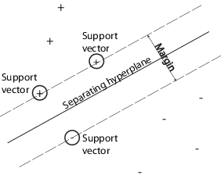
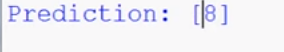
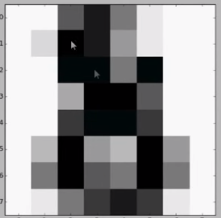

   
Machine Learning is a branch of computer science that studies the design of algorithms which learn as you give it information. 
The field is highly related to staticstics as these algorithms rely on statistics concepts. The basic premise is that we can feed
the algorithm information, we can implement predictive modeling techniques into the algorithms so it 'learns.' When we
give it new information it uses what it has 'learned' to make a prediction or perform another task.  
  
This blog post provides an overview of some machine learning concepts and equations in order to give a general understanding of
what it entails. Let's get into it!

### The K-Nearest Neighbor (KNN)
The KNN algorithm is one of the simplest machine learning algorithms. In order to achieve learning,
we measures the distance between a query (unknown) scenario and a set of known scenarios.
Here's a graph to illustrate (plusses and minuses are types of outcomes):  
  
>    

Given some outcomes and a query scenario, the algorithm will pick the K (input by the user)
nearest scenarios (neighbors) to the query scenarios and determine their outcomes. It will 
determine that the outcome that occurs the most times around it will be the outcome of query
scenario.  
  
In order to write such an algorithm, we need to determine how to compute the distances:    

$$ \sum_{i=0}^N \sqrt{(\frac {x - \overline{x}}{\sigma (x) })\^2 - y\_i\^2} $$

where \\( x \\) is the original value and \\( \overline{x} \\) is the arithmetic mean of feature \\( x \\)
across the dataset. With this equation, we can create an algorithm by letting matrix \\( D = N \times P \\) 
represent our data where \\( P \\) scenarios \\( s\^1, \ldots , s\^P\\) where each senarion \\( s\^i \\) 
contains \\( N \\) features \\( s\^i = [ s\_1\^i , \ldots , s\_N\^i]\\).  
  
We can let vector \\(r\\) store the output values of \\(M\\) nearest neighbors to query scenario \\(q\\). Let vector \\(o\\) 
with length \\(P\\) accompeny the matrix, listing the output value \\(o\^i\\) for each scenario \\(s\^i\\). 
Then we can loop through the data set measuring the distance between the set and \\(q\\):  
$$ \text{if } q \text{ is not set or } q < d(q,s\^i):q \rightarrow d(q,s\^i), t \rightarrow o\^i $$
Calculate the arithmetic mean output across r like so:

$$ \overline{r} = \frac1M \sum_{i=1}^M r\_i $$  
Return \\(\overline{r}\\) as the output value for the query scenario \\(q\\).  
  
Some example applications of KNN are any nearest neighbor based content retrieval type problems. I.E. 
problems where we need to find the closest match of something. Such problems include anything from image recognition to data mining.

### Support Vector Machine 
SVMs (Supprt Vector Machine) are a bit more involed. This algorithm achieves learning by finding the best
hyperplane that separates all data points of one class from those of the other class. Support vectors are 
the data points that are closest to the separating hyperplane. Here's an illustration:
  
>   

We start putting together the algorithm by having \\(L\\) training points where each input \\(x\_i\\)
has \\(D\\) attributes (i.e. is of dimensionality \\(D\\) and is in one of the two classes \\(y\_i = -1 \text{ or } +1\\),
i.e. out training data is of the form:  
$$ \lbrace x\_i ,y\_i \rbrace \text{ where } i = 1 \ldots L, y\_i \in \lbrace -1 , 1 \rbrace , x \in \Re \^D $$

With this, we can implement an SVM by selecting variables \\(w\\) and \\(b\\) so that our training
data can be described by \:
$$ y\_i(x\_i \cdot w + b) - 1 \le 0 \text{   } \forall\_i $$

Considering just the hyperplane, we can describe the planes \\(H\_1\\) and \\(H\_2\\) that lie on 
the Support Vector points with:  
$$ x\_i \cdot b \le +1 \text{   for } H\_1 $$
$$ x\_i \cdot b \ge -1 \text{   for } H\_2 $$
  
The distances between the two planes and the hyperplane taken together is the SVM's margin. Our
goal is to orient the hyperplaceto be as far from the Support Vectors as possible; we need to maximize
the margin.  
  
In order to do this, we need to solve these problems:  
$$ \overset{\text{max}}{\alpha} \left[ \sum_{i=1}^L \alpha\_i - \frac12 \alpha\^T H\alpha \right] \text{ s.t. } \alpha\_i \ge 0 \text{ } \forall\_i$$  

and:

$$  \sum_{i=1}^L \alpha\_i y\_i = 0 $$

Where \\(\alpha \text{ } (\alpha\_i \ge 0 \text{ } \forall\_i )\\) is a Lagrange multiplier. We do this because we need to find 
a \\(\alpha\\) which maximizes and a \\(w\\) and \\(b\\) which minimizes. This, however, is a convex quadratic optimization problem,
which we need a [Quadratic Programming solver to solve.](http://doc.cgal.org/latest/QP_solver/index.html) It will return
\\(\alpha\\) and \\(w\\). We can find \\(b\\) by using the equation:

$$ b = y\_s - \sum_{m\in S} \alpha\_m y\_m x\_m \cdot x\_s $$
where \\(S\\) is the set of indices of the Support Vectors. It is determined by finding the indices \\(i\\) where
\\(\alpha\_i \gt 0\\). 
  
Now we can create an algorithm:    
  
* Create \\(H\\), where \\(H\_{ij} = y\_i y\_j x\_i \cdot x\_j \\)    
* Find \\(\alpha\\) and \\(w\\) according to the above equations using a QP solver    
* Determine the set of Support Vectors \\(S\\) by finding the indices such that \\(\alpha \gt 0\\)    
* Each new point \\({x}'\\) is classified by evaluating \\({y}' = sgn(w \cdot {x}' + b)\\)  

Applications of SVMs include pattern recognition and other classification type problems. Here is an implementation
of an SVM classifier:

    
import matplotlib.pyplot as plt
from sklearn import datasets
from sklearn import svm

digits = datasets.load_digits()
classifier = svm.SVC(C=100)

x = digits.data[:-1]
y = digits.target[:-1]

classifier.fit(x,y)

print("Prediction: ", classifier.predict(digits.data[-1])

plt.imshow(digits.images[-1], cmap=plt.cm.gray_r, interpolation="nearest")
plt.show()


Let's go through each line:
    
import matplotlib.pyplot as plt
from sklearn import datasets
from sklearn import svm

We're going to use [sci-kit learn](http://scikit-learn.org) to provide us the complicated 
algorithm and sample data sets. We'll also use [matplotlib](http://matplotlib.org/)
to show our results.


digits = datasets.load_digits()
classifier = svm.SVC(C=100)

sci-kit learn has a lot of data sets for us to play around with. We're going to use its
digits data set. This set includes lists of coordinates for examples of what numbers look like.
So when we give the SVM coordinates of numbers, it can tell us what number it is.  
Then we set up the classifier to be used later on.  
  

x = digits.data[:-1]
y = digits.target[:-1]

classifier.fit(x,y)


`digits` has 1797 examples of numbers. Here, we set `x` equal to the coordinates of the numbers
and `y` to the actual numbers. We save the last one from both, however, so that we can give it to the
algorithm later to test whether or not it learned to recognize numbers or not. We then train the
classifier by telling it to match each coordinate with each number. At this point we have
essentially 'taught' the algorithm how to recognize numbers.


print("Prediction: ", classifier.predict(digits.data[-1])

plt.imshow(digits.images[-1], cmap=plt.cm.gray_r, interpolation="nearest")
plt.show()

We now use pass the last coordinates that we had to the classifier's `predict` method and print it out
in order to test whether or not the algorithm worked. The last two lines use matplotlib to show us
and image of what the last coordinates had in order for us to look at it and find out if the number was
what the algorithm said it was. Here's the result:

> 
(what the algorithm predicted)

> 
(what we gave to the algorithm)

### Naive Bayes
This algorithm is based on Bayes' rule, which states that if we know the probability \\(P(B\text{ }|\text{ }A)\\) 
then we can find out the probability \\(P(A\text{ }|\text{ }B)\\) in terms of \\(P(B\text{ }|\text{ }A)\\).  
 
This algorithm achieves learning by taking the query predictors and comparing it to those of each of the known outcomes,
giving a probability rating for each. The outcome of the query is the one with the highest probability rating.  
  
That probability is given by the equation:
$$ P(c \text{ }| \text{ }x) = \frac{P(x \text{ }| \text{ } c) P(c)}{P(x)} $$  
Where \\(c\\) is the outcome and \\(x\\) is the predictor. So:  
  
* \\(P(c\text{ }| \text{ }x)\\) is the probability of outcome \\(c\\) given predictor \\(x\\)
* \\(P(x\text{ }| \text{ }c)\\) is the is the probability of predictor \\(x\\) given outcome \\(c\\)  
* \\(P(c)\\) is the original probability of \\(c\\)
* \\(P(x)\\) is the original probability of \\(x\\)    

When we let  
$$ D = \left[ n\^1\_{S\_1} \ldots n\^k\_{S\_d} \right] \text{ where } n\_p\^i \text{ is the outcome } n \text{ with the set of } S \text{ predictors } $$
we can use this algorithm to find out which \\(n\\) that the query \\(q\\) predictors can be classified as:  
  
* loop through each \\(n\^i\_S\\) in \\(D\\) calculating the probability rating and store them in set \\(R\\):
$$ \prod_{i=1}^D \frac{P(q\^{i-1} | n) \cdot P(n)}{P(q)} $$
* return the highest rating in \\(R\\)

### Conclusion

##### Bibliography
[Statsoft](http://www.statsoft.com/Textbook/k-Nearest-Neighbors#classification)  

[Saravanan Thirumuruganathan](https://saravananthirumuruganathan.wordpress.com/2010/05/17/a-detailed-introduction-to-k-nearest-neighbor-knn-algorithm/)

[DataCamp](http://blog.datacamp.com/machine-learning-in-r/)

[MathWorks](http://www.mathworks.com/help/stats/support-vector-machines-svm.html)

[Tristan Fletcher](http://www.tristanfletcher.co.uk/SVM%20Explained.pdf)

[Ram Narasimhan](http://stackoverflow.com/a/20556654/2229572)

[Queen Mary University](https://www.eecs.qmul.ac.uk/~norman/BBNs/Bayes_rule.htm)

[Dr. Saed Sayad](http://www.saedsayad.com/naive_bayesian.htm)