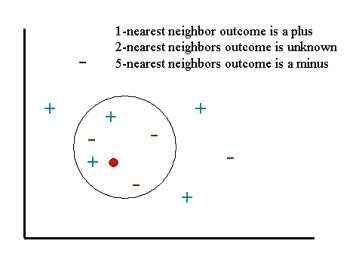

   
Machine Learning is a branch of computer science that studies the design of algorithms that can learn as you give it information. 
The field is highly related to staticstics as these algorithms rely on statistics concepts. The basic premise is that we can feed
the algorithm information, we can implement predictive modeling techniques into the algorithms so it 'learn', so that when we
give it new information it can use what it has 'learned' to make a prediction or perform another task.  
  
This blog post will give an overview of some machine learning concepts and equations in order to give a general understanding of
what it entails. Let's get into it:

### The K-Nearest Neighbor Algorithm (KNN)
The KNN is one of the simplest machine learning algorithms. In order to achieve learning,
we measures the distance between an query (unknown) scenario and the set of known scenarios.
Here's a graph to illustrate (plusses and minuses are type of outcomes):  
  
>    

Given some outcomes and a query scenario, the algorithm will pick the K (input by the user)
nearest scenarios (neighbors) to the query scenarios and determine their outcomes. It will 
determine that the outcome that occurs the most times around it will be the outcome of query
scenario.  
  
In order to write an algorithm like that, we need to determine how to compute the distance:    

$$ \sum_{i=0}^N \sqrt{(\frac {x - \overline{x}}{\sigma (x) })\^2 - y\_i\^2} $$

where \\( x \\) is the value and \\( \overline{x} \\) is the arithmetic mean of feature \\( x \\)
across the dataset. With this equation, we can create an algorithm by letting matrix \\( D = N \times P \\) represent our data where \\( P \\) scenarios \\( s\^1, ... , s\^P\\)
where each senarion \\( s\^i \\) contains \\( N \\) features \\( s\^i = [ s\_1\^i , ... , s\_N\^i\\).  
  
We can let vector \\(r\\) store the output values of \\(M\\) nearest neighbors to query scenario \\(q\\). Let vector \\(o\\) 
with length \\(P\\) accompeny the matrix, listing the output value \\(o\^i\\) for each scenario \\(s\^i\\). 
Then wecan loop through the data set measuring the distance between the set and \\(q\\):  
$$ \text{if } q \text{ is not set or } q < d(q,s\^i):q \rightarrow d(q,s\^i), t \rightarrow o\^i $$
Then we calculate the arithmetic mean output across r like so:

$$ \overline{r} = \frac1M \sum_{i=1}^M r\_i $$  
Then return \\(\overline{r}\\) as the output value for the query scenario \\(q\\).  
  
Some example applications of KNN are any nearest neighbor based content retrieval type problems. I.E. 
problems where we need to find the closest match of something. These types of problems include anything from image recognition to data mining.

### Support Vector Machine Classification 
SVMs (Supprt Vector Machine) are a bit more involed. This algorithm achieves learning by finding the best
hyperplane that separates all data points of one class from those of another class.  

##### Bibliography
[Statsoft](http://www.statsoft.com/Textbook/k-Nearest-Neighbors#classification)  

[Saravanan Thirumuruganathan](https://saravananthirumuruganathan.wordpress.com/2010/05/17/a-detailed-introduction-to-k-nearest-neighbor-knn-algorithm/)

[DataCamp](http://blog.datacamp.com/machine-learning-in-r/)

[MathWorks](http://www.mathworks.com/help/stats/support-vector-machines-svm.html)

[Tristan Fletcher](http://www.tristanfletcher.co.uk/SVM%20Explained.pdf)