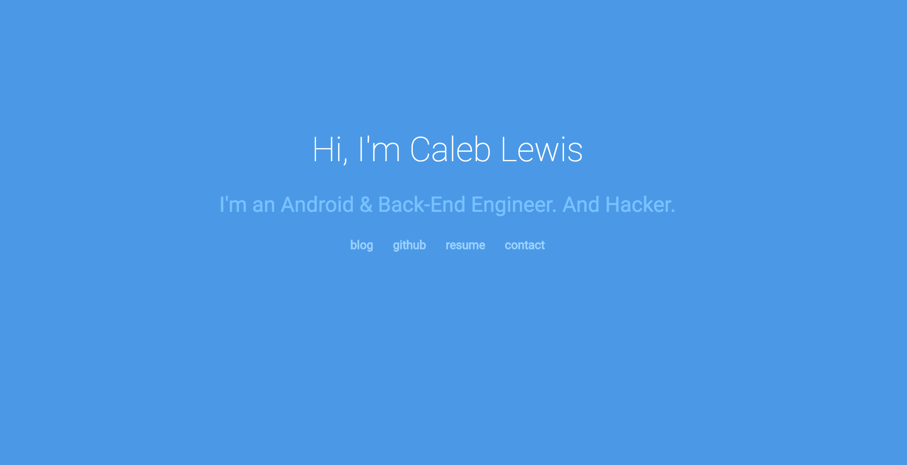
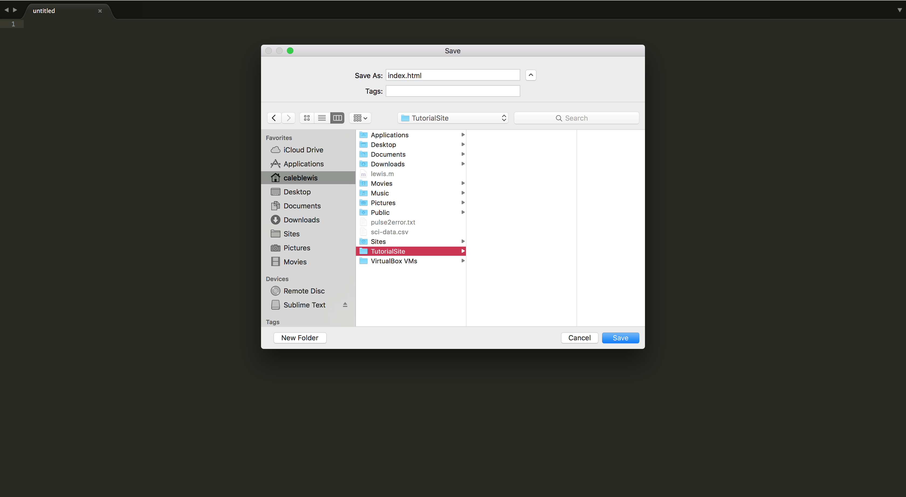
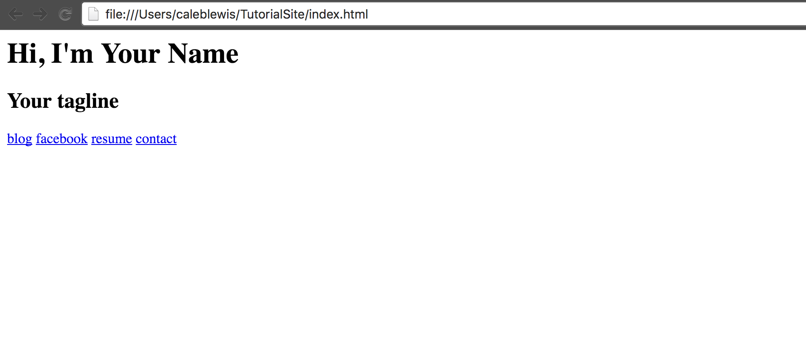
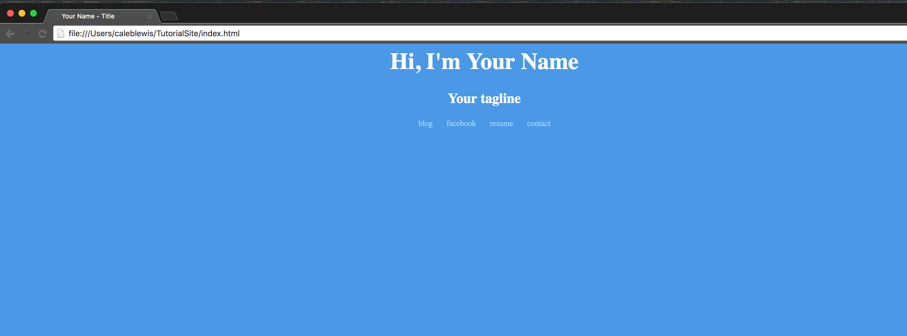

In this tutorial i'll be teaching web development through walking through how to build your own site. As we build the
page, i'll explain everything you need to get started learning about web development. Let's get stated!

## 1. The End Product
Here's what we'll be building:
  
  
It'll be a personal site that establishes your official brand. It'll have links to other places on the internet
where you can be found, a resume link, and a link to that will, when clicked, add open the user's email client to start an email to you.
  
 ## 2. Text Editors
The first thing we'll need to start this website is a good text editor. We need a place to write our code - and that's
exactly what a text editor will do for us. There are many choices from [Notepad++](https://notepad-plus-plus.org/)
to [Brackets](http://brackets.io/) to [Visual Studio Code](https://code.visualstudio.com/) and many many more.  
  
The one we will be working with is Sublime Text 3. It's a simple editor that can become very powerful when you know its ins
and outs. It's a very popular piece of software! [Download it here.](https://www.sublimetext.com/) If you have an editor
that you already use and are familiar with, feel free to use that instead. 

## 3. Files
After installing a text editor, we can get started on building the web page!    
In order to display a web page, browsers like Google Chrome read files that have certain kinds of instructions in them
detailing how the web page should be displayed. These kinds of instructions are called programming languages, and the 
ones that browsers understand are HTML, CSS, and Javascript files. We will cover only HTML and CSS and 
give you the resources to learn about Javascript.  
  
First, create a folder on your computer where you want to store the website. In Sublime, go to File -> New File and then press
`ctrl + s`. This will open up a prompt asking you to choose where you want to save the file and what you want it to be named.
Name the file `index.html` and save it in the folder you created earlier.
  
  
  
Notice how the file ends in `.html`. This is a reminder for you and for the browser that this file contains html code that the
browser needs to read. We named the file `index` to tell the browser that this is the first web page to open up when trying
to find a file to open in a directory.  
  
In your file explorer (explorer on Windows & Finder on Mac), navigate to the file you just saved and open in it in a browser.  
(If you're having trouble with that, just drag the file to the browser window).  
  
Go back to your text editor, type something random inside, save (control + s), and then refresh the browser window.
This is the workflow for most web developers to create web pages, and the one we will use in this tutorial!  

## 4. HTML
HTML stands for `HyperText Markup Language`. It's one of the most basic language you can program in, but still very important
to know for web development.  
  
HTML files are made of up `tags`. Each tag is an instruction for the browser telling it to do something. Here's an example:  
  

	
 Hello World 


  
`
` is the opening tag. This tells the browser that everything after this is going to be associated with the tag. This particular
tag is the *paragraph* tag. It tells the browser that the text inside the tag is supposed to be in paragraph format.   
  
`
` is the closing tag. All tags must have a closing tag to tell the browser when it ends. 
  
The stuff inside the tags is all the content you want to be inside the tag. Different tags expect differeny kinds of content.  
  
Now we'll learn about attributes:  
  

	<a href="http://google.com">Link to google</a>

  
This is a tag that has an attribute: the `href="http://google.com"` part. This gives the brwoser further informtion on what to 
do with the element. In this case, it tells the `anchor (a)` tag to link to google.com.  
  
Those are the bare basics of HTML. You can [go here](http://www.htmldog.com/references/html/tags/) to explore all the different tags you can experiment with. 
  
Let's get started with our web page: 


<!DOCTYPE html>
<html>
	<head>
		<title>Your Name - Title</title>
	</head>
	<body>
		
	</body>
</html>
  
  
Let's break this down:  
  

<!DOCTYPE html>
  
  
This is called the doctype. It tells the browser what version of HTML you're going to use. This is the latest - HTML5.
  

<html></html>

  
This marks the beginning of the HTML document - every page must have this element. It content is everything else on the page. 
  

<head></head>
  
  
This tag contains all of the things that users don't see in the web page, such as links to other files (we'll go over that soon) and [meta information.](http://www.sitepoint.com/meta-tags-html-basics-best-practices/)


<title></title>
  
 
This tag puts the text in the content on the tab.  
  

<body></body>

  
This is where everything that the user sees goes - the meat of the webpage. Every html document must have this.  
  
These are thhe building blocks that all web pages need! Now let's make the content of our webpage! Add this inside the body tag:  
  


	<h1>Hi, I'm Your Name</h1>
	<h2>Your tagline</h2>

>
  
  
Make sure to fill your name and tagline in!    
   
`div` stands for *divider*. You can use it to mark sections on your web page. We gave it an attribute called `class`. 
This attribute can be put in any tag - it provides a reference to the tag so you can do things to it in CSS and Javascript. We'll
cover more about that later.   
  
`h1` is a header tag. Head tags range from `h1` to `h6`, biggest to smallest.  
  
Next We'll do the links - put this under the `h1` tag:  
  

	

		<a class="link-item" href="your blog link">blog</a>
		<a class="link-item" href="your facebook link">facebook</a>
		<a class="link-item" href="your resume">resume</a>
		<a class="link-item" href="mailto:your email">contact</a>
	


  
We briefly went over `p` and `a` tags, but they're *paragraph* and *anchor* tags. We use paragraph tags to 
tell the browser we want a paragraph and anchor tags for links.  
  
Your code should look like this:  
  

<html>
	<head>
		<title>Your Name - Title</title>
	</head>
	<body>
		

			<h1>Hi, I'm Your Name</h1>
			

				<a class="link-item" href="your blog link">blog</a>
				<a class="link-item" href="your facebook link">facebook</a>
				<a class="link-item" href="your resume">resume</a>
				<a class="link-item" href="mailto:your email">contact</a>
			

		

	</body>
</html>
  
  
That's it! That's all the HTML we need. Save the file and view it in the browser: 
  
  
  
The page doesn't look anything like what its supposed to! This is because HTML only tells the browser *what* to put on the 
web page. We have to use something else to tell it *how* everything is supposed to look. Enter CSS:  
 
## 5. CSS  
CSS (cascading style sheets) is the language that tells the browser how the web page is supposed to look. A CSS file ends with `.css`. Create
a new file called `style.css` in the same directory as the `ìndex.html` file. Back in the index file, add this line to `head` tag:  
  

	<link rel="stylesheet" href="style.css"/>
  
  
This tells the browser to load that css file so that we can add some style to our web page!
  
CSS files are made up of declarations about which element on the web page you want to edit, and what styles you want to give them. Here's what
that would look like:  
  

p {
	font-size:15px;	
}
  
  
We give it the selector (a `p` tag) and give it some opening and closing curly braces. Inside the braces we can give the element (tag) 
whatever properties and values we want. `font-size` is the property that controls how big the text should be. We give it a value of `15px`.
`px` is one of the most used measurements on the web - 1px is exactly 1 pixel on your computer screen. So the bigger the resolution of the screen,
the small each pixel becomes.  
  
[Here's a list of the properties you can use in CSS.](http://www.w3schools.com/cssref/) While we're going through css, feel free to loop up the
properties and learn more about them there.
  
Don't forget the semicolen at the end!  
  
Let's start styling our page. In your `style.css` file, type this:  
  

body{
	background-color: #4B99E6;
	color:#fff;
	text-align:center;
}
  
  
Here, we referenece the `body` tag. For these colors, we use hexidecimal codes to tell the browser exactly which color we want.
You can choose whatever color you want - [here is a list of hex codes](http://html-color-codes.info/).  
  
`background-color` is pretty self explanatory, but `color` is a bit ambiguous. It refer to the color of the text inside the element.
Since everything is inside the `body` tag, all the text will be `#fff` (that's white.)  
  
`text-align` tells the browser how we want the text aligned on the page. Here, we want everything to be dead center. 
  
If you look at the web page (after saving), you'll see it changed! Let's change more stuff:  
  

h1{
	font-size:40px;
	margin-top: 0;
}

h3{
	font-size:25px;
	font-weight: bolder;
	color: #79C1FF;
}
  
  
Two new properties here: `margin-top` and `font-weight`. `margin-top` decides how much space from the top we want the element we have.
We set it to 0 because the browser applies default properties to elements, and sometimes we don't want those properties - especially this 
case. Margins are a part of what's called the *box model* in css. It's the philosophy behind positioning in CSS. You can read more about it [here](https://developer.mozilla.org/en-US/docs/Web/CSS/CSS_Box_Model/Introduction_to_the_CSS_box_model)  
  
`font-weight` defines how bold the text is. We wanted to make sure it's bold.  
  

.link-item{
	margin-left:10px;
	margin-right:10px;
	display: inline-block;
	color:#9CD1FF;
	text-decoration: none;
	font-size: 14px;
}
  
  
Remember when we declared those class attributes in the HTML? Here is where we are referencing them. That `.` in CSS lets us refer
to classes that we set in the HTML. So anything with the class `link-item` gets all the styling inside these curly braces.  
  
`text-decoration` lets your add (or take away) things like strikethroughs and underlines. The browser, by default, gives an underline
to all links, but it won't look good in this situation, so we tell it to have no text-decoration.  
  
Another new property here is `display`. This tells the browser how we want the element to behave relevant to the other elements around it.
There are two options: inline, block, or inline-block. Block elements take up the whole line on a web page, while inline elements 
can be placed next to each other. Inline-block elements keep all of the box-model characteristics while still being able to be placed next to other elements.
Feel free to experiment with these values and read more about [inline](https://developer.mozilla.org/en-US/docs/Web/HTML/Inline_elements) vs [block](https://developer.mozilla.org/en-US/docs/Web/HTML/Block-level_elements) elements.  
  
Go ahead and save and view your webpage. It should look something like this (but with different text):  
  

  
All we need to do now is push everything to the vertical middle. There isn't really a good way to do that in CSS, so we'll have to use margins to eye it.
Go back to the `h1` declaration and add this line: 
  

margin-top:280px;
  
  
View it in your browser!  
  
Now that we created the web page, we'll get them online!  
[Link 1](https://pages.github.com/)  
[Link 2](http://stackoverflow.com/a/9123911/2229572)