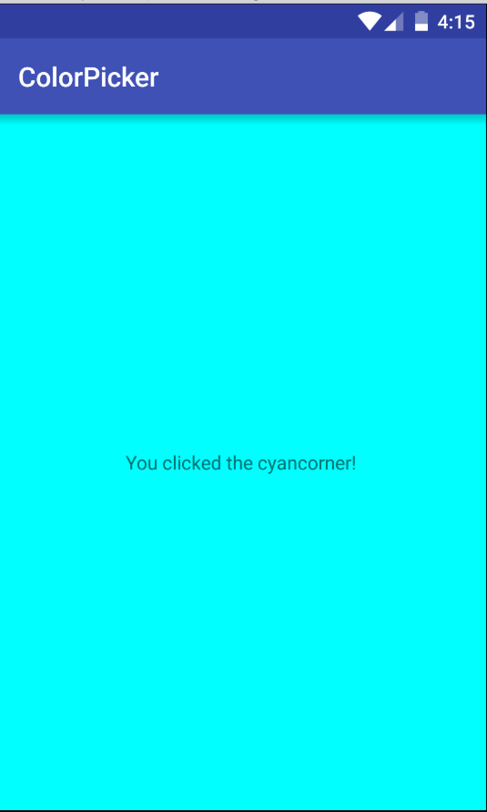
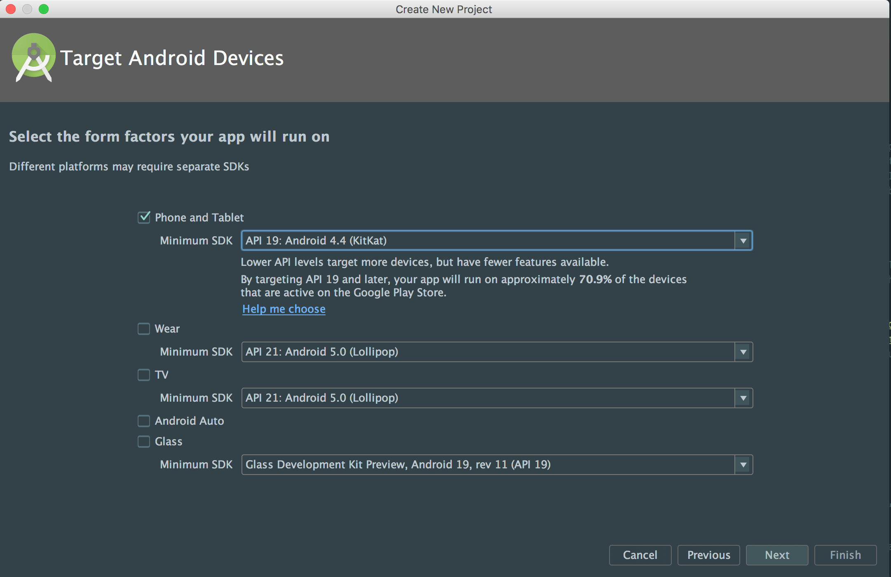
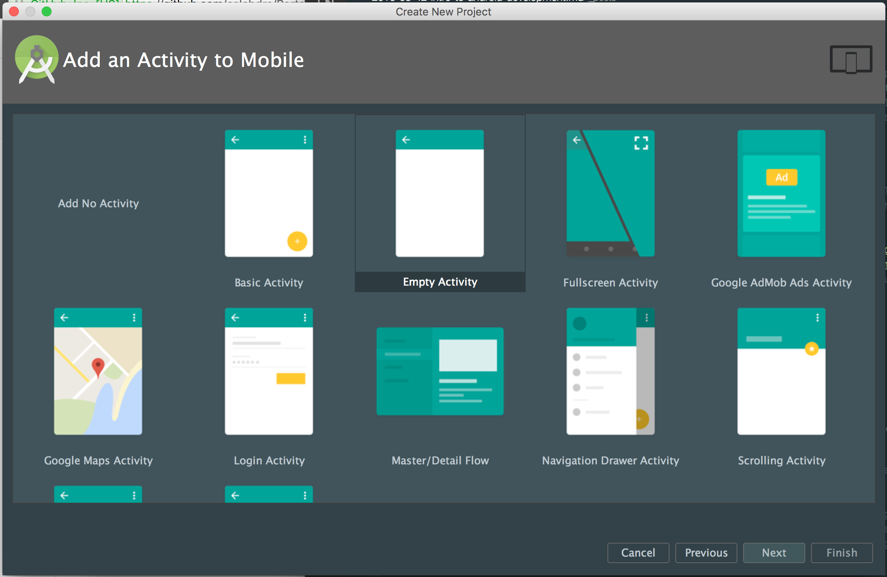
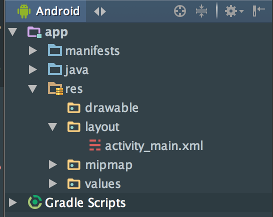

In this tutorial we will be going over how to create android apps. 
There will be lots of new concepts that we'll need to go over. Let's get into it:  

## What is Android?
You're probably thinking that's a silly question, but it's important to know what platform it is exactly that you're
building on. The Android OS is an open source project created by Google that aims to standardize phone operating systems. Before it, phone companies
would have to create whole operating systems for every phone they wanted to sell. It cost a lot of time and money, but
Now, because of android, they can focus on creating awesome phones and not worry about the OS. We're all the better
for it.  
  
## What are Android apps?
Google gives you a framework you have to  use in order for your programs to run on their operating system. A framework
is pre-written code that you can use so that you don't have to write it yourself. The framework is written in 
Java because, at the time, that was the language that most developers knew. Now, there are many ways
to create Android apps, but we'll be doing it the easiest/traditional way.  
  
The official android IDE is Android Studio. [Download it here](http://developer.android.com/sdk/index.html) if you haven't already (it'll take ~20 minutes.)
If you don't have an Android phone, [install Genymotion](https://www.genymotion.com/pricing-and-licensing/) (the free option is under 'individual'). 
It's an android emulator - it'll let you run the android OS on your computer so you can run your android apps on it if
you don't have a device.  
  
Let's jump into making an app!!  
  
## Finished Product
We'll be making a color picker!  

  
  
When you click on a side, it'll change another color. You can choose whatever colors you want.  
Let's jump you!


## Starting a project
The first thing we'll need to do is set up a project in Android Studio. To do this, just open it up. You'll
be prompted for the next action: just select "Start a new Android Studio project."  
  
Fill in the informaiton on the first page. You only really need to fill out Application name. If you leave everything 
default it's fine - it's not all that important.  
  
The next screen will ask you which version of the operating system you want to target and which android devices. This is really important
because you have to choose whether you want to use the newest, coolest version of android with all the hip new
feature or support people who may not have upgraded. It will tell you the percentage of users who have
which version to help you decide.  
  
We'll be using `API 19: Android 4.4 Kitkat`.  
  
  
    
The next screen will ask you if you want to use a template that Googlers thought might be helpful to start out with.
Later on, you can use any of these to look at the code to see how Google thinks you should write android apps (becaus you know, there are many ways to write programs).  
  
We're going to chose `Empty Activity` because that's the most helpful one for the app we'll be making.
    
  
  
Next, it'll ask you what you want the starting 'activity' and layout to be called (don't worry, we'll go over what those are soon.)
Usually we call those the `MainActivity` and `activity_main`, and that's what is already there so just click next.

  
  
Congratulations! We're all set up. Now it's time to dive into some code and learn some new android dev concepts!  
  
## XML: Developing the UI
XML stands for Extensible Markup Language, and it's what android uses to create user interfaces.      
Let's get an idea of waht XML looks like this:  
  

	<TagName attributeName="value">
		<ChildTagName />
	</TagName>
  
  
These are called `tags`. They begin with a `<` and end with a `>`. The name of the tag comes after the `<`,
and in between that and the end you can declare more bits of information about the tag using
`attributes`. An attribute has a name and value, and are declared as in the example above.  

Tags can have over tags inside of it. If you open a tag you have to make a closing tag, which looks like the last
line of the example above. If the tag doesn't need to have other tags inside of it, you can just declare it
like in the second line of the example. 


In android studio open up your `activity_main.xml` file found in `main/res/layout` directory.  
  
  
  
You're currently in the design view. This isn't very useful 97% of the time, so let's change it to something more helpful; 
at the bottom left corner of the new window, select the `Text` tab. Here, you'll see the building blocks of the
UI of your app! Right now it just has a white screen with Hello World printed.

Let's take a look at the file. Delete everything inside and replace it with this:     
  

<?xml version="1.0" encoding="utf-8"?>
<RelativeLayout xmlns:android="http://schemas.android.com/apk/res/android"
	android:layout_width="match_parent"
	android:layout_height="match_parent"
	
	android:paddingBottom="10dp"
	android:paddingTop="10dp"
	
	android:paddingLeft="15dp"
	android:paddingRight="15dp">

	<TextView
		android:layout_width="wrap_content"
		android:layout_height="wrap_content"
		android:text="Hello World!" />
</RelativeLayout>
  
  
Let's break it down:  
  

	<?xml version="1.0" encoding="utf-8"?>

  
This line tells Android what kind of xml we're using (version=1.0) and what characterset we're using (encoding=utf-8).  
  

	<RelativeLayout xmlns:android="http://schemas.android.com/apk/res/android"
  
  
This starts the `RelativeLayout` tag declaration. It doesn't end in `>` because there are a lot of attributes
that follow it. This is pretty regular in Android because we use these tags to tell Android how we want
something to look on screen. The `xmlns:android="http://schemas.android.com/apk/res/android"` lets us
use all of the android attributes that Google put in the android framework.  
  
Specifically, `RelativeLayout` is used to declare the kind of layout that you want to have. There are quite a 
few, but the main ones are `RelativeLayout` and `LinearLayout`. We use `RelativeLayout` when we want to position
elements relative to each other. Life if you want to have 2 buttons inside the layout and one button
right below another one, `RelativeLayout` lets us do that easily with specific attributes.  
`LinearLayout` lets you layout elements in a linear fashion. You can choose to have it layout
elements vertically or horizontally, and it'll do just that.  
  
```
	android:layout_width="match_parent"
	android:layout_height="match_parent"
```  
  
notice we prefix the attribute name with `android:`. that's what the `xmlns...` stuff was for. Google
gives us this prefix so we can tell android exactly how we want to position something on the screen.
`layout_width` and `layout_height` specify the width and height of the element. We could give it a specific
size, but we want it to stretch the full width and height of the entire screen. We give it the value of
`match_parent`. It'll be the same dimensions as the parent element (the element that it is inside of,) and since 
it's not inside of another element, it assumes that the entire screen is the parent.  
  
```
	android:paddingBottom="10dp"
	android:paddingTop="10dp"
	
	android:paddingLeft="15dp"
	android:paddingRight="15dp"
```
  
These attributes put the content inside the element away from the direction you specify by the amount you also specify. 
So `android:paddingBottom="10dp"` pushes the content inside from the bottom by `10dp`. `dp` is a unit of measurement 
that is based on the pixel density of your screen. It's the preferred unit because it adpats to the user's phone
screen size, however you can learn more about other units [here](http://stackoverflow.com/a/2025541/2229572).  
 

	<TextView
		android:layout_width="wrap_content"
		android:layout_height="wrap_content"
		android:text="Hello World!" />
  
  
This element is just a block of text. We give it a `layout_width` and height of `wrap_content`, which means that it's 
only going to take up the space it needs. No more, not less.    
The last attribute is `text`. This is a `TextView` specific attribute that tells android what text should
go in the textbox. Most elements have attributes specific to themselves because each one serves a different 
purpose. 


	</RelativeLayout>
  

This closes the `RelativeLayout` that we declared near the top. 
  
That's it for the default stuff! Let's make our own interface! Replace all the
code in that file with this:  
  

 
<?xml version="1.0" encoding="utf-8"?>
<RelativeLayout xmlns:android="http://schemas.android.com/apk/res/android"
    android:layout_width="match_parent"
    android:layout_height="match_parent"
    android:id="@+id/root">

	<View
      android:id="@+id/topLeftButton"
      android:layout_width="100dp"
      android:layout_height="100dp"
      android:layout_alignParentLeft="true"
      android:layout_alignParentTop="true"
      />

    <View
        android:id="@+id/topRightButton"
        android:layout_width="100dp"
        android:layout_height="100dp"
        android:layout_alignParentRight="true"
        android:layout_alignParentTop="true"
        />

    <View
        android:id="@+id/bottomLeftButton"
        android:layout_width="100dp"
        android:layout_height="100dp"
        android:layout_alignParentLeft="true"
        android:layout_alignParentBottom="true"
        />

    <View
        android:id="@+id/bottomRightButton"
        android:layout_width="100dp"
        android:layout_height="100dp"
        android:layout_alignParentRight="true"
        android:layout_alignParentBottom="true"
        />
		
	<TextView
		android:id="@+id/centerText"
        android:layout_width="wrap_content"
        android:layout_height="wrap_content"
        android:layout_centerInParent="true"
        android:text="Tap any corner!"/>
</RelativeLayout>
   
   
 Let's go over this code:
 
 
 	<?xml version="1.0" encoding="utf-8"?>
	<RelativeLayout xmlns:android="http://schemas.android.com/apk/res/android"
		android:layout_width="match_parent"
		android:layout_height="match_parent"
		android:id="@+id/root">
   
  
This is the same as in the last example, but with a new attribute: `id`. `id`s are identifiers for
the elements in the XML. Using these identifiers, we can get a reference to the element in the Java
code and do things with it like add more attributes or respond to events like taps or long presses.  
  
The `@+id` part is telling android that this is a new ID that we want it to keep track of. The `/root`
part is the name of the id that we'll use later.  
  
  
 
	 <View
		android:id="@+id/topLeftButton"
		android:layout_width="100dp"
		android:layout_height="100dp"
		android:layout_alignParentLeft="true"
		android:layout_alignParentTop="true"
      />
   
   
The `View` element doesn't have any special functions or anything - it just represents space on the screen. 
We specify exactly how much space in the `layout_width` and `layout_height` attributes: `100dp`. This can
be as big or small as you like, but remember that we're going to have 4 of these on the screen!  
  
Some new atrtibutes are `layout_alignParentLeft` and `layout_alignParentTop`. These aren't attributes specific
to the `View` element - they're specific to everything inside a `RelativeLayout` tag. We couldn't use
it inside of a `LinearLayout`. These attributes let us position the element relative to its parent, the `RelativeLayout`.
The only values it can be are `true` and `false`. `alignParentLeft` will align the element to the left
edge of its parent. `layout_alignParentTop` will do the same, but for the top edge. There's also a 
`layout_alignParentRight` and `layout_alignParentBottom`.  
  
We just copy and and paste that element and change the position: we want one at each corner of the screen.  
  
We'll skip to the last element:  
  
  
	<TextView
        android:layout_width="wrap_content"
        android:layout_height="wrap_content"
        android:layout_centerInParent="true"
        android:text="Tap any corner"/>
  
  
The new attribute here is `layout_centerInParent`. This is silimar to the `layout_alignParentTop` in that it
position the element relative to the parent. This attribute position the element, the `TextView` in the dead
center of the parent. Because the parent takes up the entire height and width of the screen, the `TextView` will
show up in the middle of the screen.  
  
Our Ui is finished! Let's start making this app actually function.

## Setting up the Activity    
Open up your `MainActivity` found in the `main/java` folder. It should look like this:  
  

public class MainActivity extends AppCompatActivity {

	@Override
	protected void onCreate(Bundle savedInstanceState) {
		super.onCreate(savedInstanceState);
		setContentView(R.layout.activity_main);
	}
}
  
  
An *Activity* is basically a 'screen' that the user sees. You can have many different 'screens' 
in your app, and each one of them would be a new activity. Our activity, `MainActivity`, inherits
`AppCompatActivity`. The android framework provide us with this class. It gives us a starting point 
for each of the activities. The Android OS expects apps to conform to certain behaviors, and 
inheriting the `AppCompatActivity` class allows us to easily not worry about it while writing our 
apps.  
  
One way it helps us is the method that's in there already! The `onCreate` method executes as
soon as the screen becomes active. Methods like these are called *lifecycle methods* because 
there are certain events on the phone that you probably and to hook into, like when the user
turns off their phone screen, goes to another app, kills the app, etc.  
  
Inside this method, we want to setup our view. The two lines inside the `onCreate` method are important:  
  

super.onCreate(savedInstanceState);
setContentView(R.layout.activity_main);
  
  
The first line calls the constructor on the `AppCompatActivity` class. This creates the activity on the OS.  
The next line tells android what layout to use for the activity. `R.layout.activity_main` references that
file in the `main/res/layout` folder.  
  
`R` is a static class android gives to us that we can use to reference anything in the `/main/res` folder.
We can access them via the same hierarchy (`res/layout/activity_main.xml` and be access by `R.layout.activity_main`.)  
  
## Wiring up the Elements
Now we need to get references for all the elements we have in the XML so that we can do something when someone
taps on them. Add this code to the `onCreate` method:  
  

View topLeftSpace = findViewById(R.id.topLeftButton);
View topRightSpace = findViewById(R.id.topRightButton);
View bottomRightSpace = findViewById(R.id.bottomRightButton);
View bottomLeftSpace = findViewById(R.id.bottomLeftButton);
TextView centerText = (TextView) findViewById(R.id.centerText);
RelativeLayout root = (RelativeLayout) findViewById(R.id.root);
  
  
The `findViewById` method is provided by the `AppCompatActivity` class. It returns a `View` object
that corrosponds to the object in the app. The `R` class also provides us with all the IDs we specified in the XML.
We pass that into the `findViewById` method.  
  
For the `centerText` variable, we're trying to get a `TextView` object rather than a `View` object so we can get
all of the `TextView` specific methods, so we cast the result of the method to a `TextView`. Same thing with `root`.  
  
## Listening for Touches  
Next we're going to set up event listeners so that we can respond to when the user taps each corner of the screen:  
    

topLeftSpace.setOnClickListener(new View.OnClickListener() {
	@Override
	public void onClick(View v) {
		root.setBackgroundColor(Color.RED);
		centerText.setText("You clicked the red corner!");
	}
});
  
  
Here, we call the `setOnClickListener` function, which accepts an `OnClickListener` interface. Instead of creating
a new class, we're going to write in inline. The only method on the interface is `onClick`. It gives us a view,
the one we clicked, in the method to do what we want. When clicked, call the `setBackgroundColor` method on the 
`RelativeLayout` view that we created earlier. We also set the text of the `TextView`.  
  
We do the same for the other corners. Your `onCreate` method should look something like this:  
  

public class MainActivity extends AppCompatActivity {

    @Override
    protected void onCreate(Bundle savedInstanceState) {
        super.onCreate(savedInstanceState);
        setContentView(R.layout.activity_main);

        View topLeftSpace = findViewById(R.id.topLeftButton);
        View topRightSpace = findViewById(R.id.topRightButton);
        View bottomRightSpace = findViewById(R.id.bottomRightButton);
        View bottomLeftSpace = findViewById(R.id.bottomLeftButton);
        final TextView centerText = (TextView) findViewById(R.id.centerText);
        final RelativeLayout root = (RelativeLayout) findViewById(R.id.root);

        topLeftSpace.setOnClickListener(new View.OnClickListener() {
            @Override
            public void onClick(View v) {
                root.setBackgroundColor(Color.RED);
                centerText.setText("You clicked the red corner!");
            }
        });

        topRightSpace.setOnClickListener(new View.OnClickListener() {
            @Override
            public void onClick(View v) {
                root.setBackgroundColor(Color.CYAN);
                centerText.setText("You clicked the cyancorner!");
            }
        });

        bottomLeftSpace.setOnClickListener(new View.OnClickListener() {
            @Override
            public void onClick(View v) {
                root.setBackgroundColor(Color.BLUE);
                centerText.setText("You clicked the blue corner!");
            }
        });

        bottomRightSpace.setOnClickListener(new View.OnClickListener() {
            @Override
            public void onClick(View v) {
                root.setBackgroundColor(Color.MAGENTA);
                centerText.setText("You clicked the magenta corner!");
            }
        });
    }
}
  
  
Congratulations, you just finished your first android app! Woo!!  
  
## Learning More  
I bet you're ready to learn a bunch more stuff. Here are some resources to help you out:  
  
[Derek Banas offers a really good video tutorial serious](https://www.youtube.com/playlist?list=PLGLfVvz_LVvSPjWpLPFEfOCbezi6vATIh)  
[Sort of more advanced Android tutorial by Slidenerd](https://www.youtube.com/playlist?list=PLonJJ3BVjZW4Vpa7bslPSDDIIYHBC5iut)  
[Here's a collection of awesome written tutorials that always stay updated](http://guides.thecodepath.com/android)  
[The official documentation is really good too](http://developer.android.com/training/index.html)  
[Really useful subreddit](https://www.reddit.com/r/androiddev/)