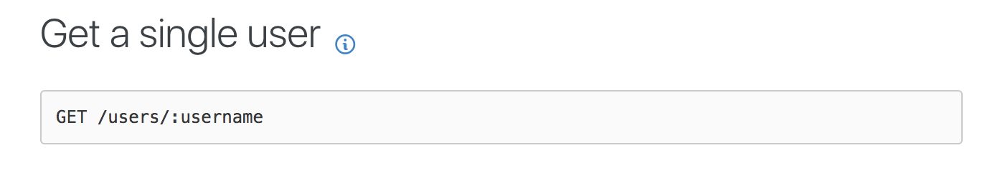
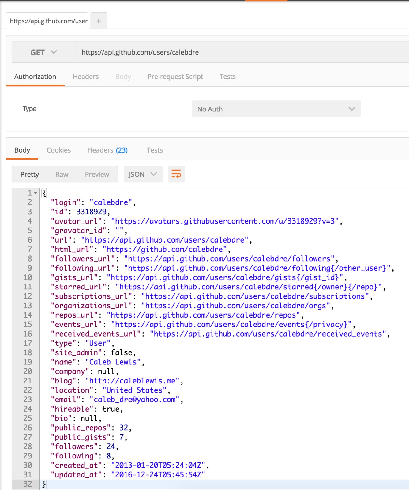
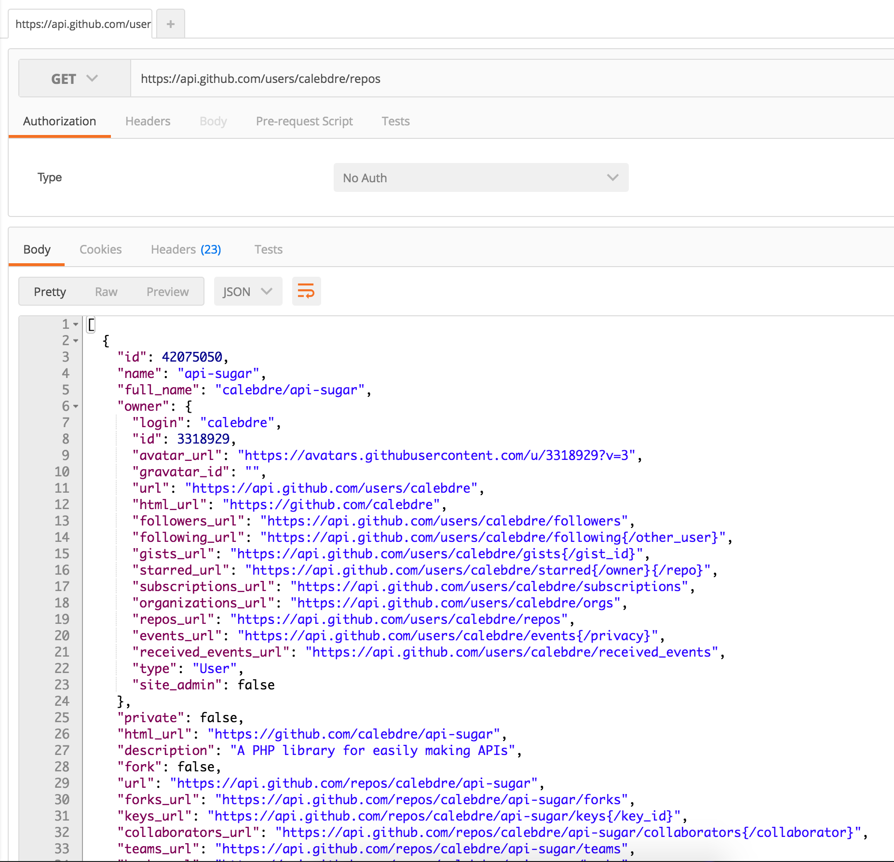

Using API services can help speed up development of an app and 
provide features that would otherwise take a lot of non-coding resources to 
build. Usually APIs provide services and information in an easily consumable manner,
and i'll provide an introduction to all the things you need to know to use them.

## What is an API?  
Usually when we talk about APIs that do the things I mentioned above, we're 
talking about web service APIs.  
  
API stands for Application Programming Interface.
It's the set of tools that one needs to build applications. For example:
the Java API is a set of methods that let you build Java applications, and
it includes the [io](https://docs.oracle.com/javase/7/docs/api/java/io/package-summary.html) package for 
interacting with the filesystem, the [net](https://docs.oracle.com/javase/7/docs/api/java/net/package-summary.html) package for networking,
and the [awt](https://docs.oracle.com/javase/7/docs/api/java/awt/package-summary.html) package for GUIs. 
  
Web services are services that people or companies make available for other people 
to use across the internet. Facebook, for example, makes data about their users
available through a web service for anyone who wants to use it. Another
example of a web service would be one that we'll work with in this tutorial: Twilio.
They provide telephony web services that allow anyone to create applications that send text messages,
make phone calls, record calls, and many other functions.  
  
In order to use these services, we have to use the API given to us to communicate 
what information or action we want to take. All of this communication happens via the
HyperText Transfer Protocol (HTTP), which we'll need to know about to understand how to use an API. 
  
## HTTP Basics  
HTTP is how most computers communicate with each other via the internet. When you 
type a website address into your favorite web browser, it makes an HTTP connection to the
computer that has the address you typed and requests the website. In this example, we'll
call your computer, the one requesting the website, the client and the computer that has the
website you're looking for the host. Once the client has made the request, the host reponds
with data. In this case, the data is all the assets that the browser needs to be able to render
the site.  
  
If you're using Google Chrome, open up the developer tools by right clicking on the page and selecting
**Inspect**. In the tabs at the top of the pane that just showed up, click on **Network** and then 
refresh this page. You'll see all of the HTTP requests that the browser made to create this web page. 
If you click on one, you'll see all of the data that was transfered through in that request.  
  
Most APIs conform to a standard recently instituted to make sure that APIs are consistent and
cohesive. This standard is called REST.  

## REST Basics  
Representational state transfer (REST) is a way of organizing an API. It creates predictable 
APIs that hopefully make sense to people using it. To start, REST APIs conform to a certain url scheme
that resembles a filesystem: each term after a backslash (/) indicates a relation to the term before it.  
  
For example: from the url `/people/john/profile`, we can assume a few things:   

* There are multiple people that we can access  
* We can access people just by passing in their name  
* We can access metadata from a person by specifying what kind of data after the name

RESTful APIs also have a use the HTTP concept of called *verbs*. Verbs tell the server what action 
you want to take.Th verbs that you use to create a request indicates what kind of action that you want to take:  

- GET: we only want to just recieve information backs
- POST: we want to create new data, give information to get dynamic data, or a combination of the two
- PUT/PATCH: we want to update something
- DELETE: we want to delete something from

These verbs combined with the url scheme tells the server what action we want to take on what data.
Most modern APIs return data in a Javascript Object Notation (JSON) format. It's a really simple
format that only uses key-value pairs, is easily parsable, and only has a few rules. Here's what 
it looks like:

````
{
	"person": {
		"city":"Atlanta",
		"name":"John Doe"
	}
}
```
  
You can learn more about HTTP and REST [here](https://code.tutsplus.com/tutorials/a-beginners-guide-to-http-and-rest--net-16340),
but now let's use all this information to query some APIs.  
  
## Postman
First thing's first: download [Postman](https://www.getpostman.com/). It's some neat software that
helps us easily create HTTP requests. It lets use control every aspect of what's sent over the wire
with a really nice GUI.

## Github API
We'll be using Github's API to explore making HTTP requests to apis in general. You can find
the documentation to their API [here](https://developer.github.com/v3/).  We're going to make a request
to pull github data about yourself.  
  
If you scroll down a little passed on the documentation page, you'll see a *Schema* section. This tells you
how the API expects to recieve information and that `https://api.github.com` is the base url.  
  
We'll go to the [users](https://developer.github.com/v3/users/#get-a-single-user) section to find out 
how to pull information about a specific user:  

  
  
It looks like we can just put in `/users/username` to get the information about whoever we pass in. 
In Postman, open a new request tab and enter the url "*https://api.github.com/users/USERNAME*" where
USERNAME is your actual username and click send. It should look something like this:

  
  
Lets get some ancillary information. You can append `/repos` to the url to get a listing of all your github
repositories:

  
  
Notice that we're using a GET request to get the information and the url scheme that we're using.

